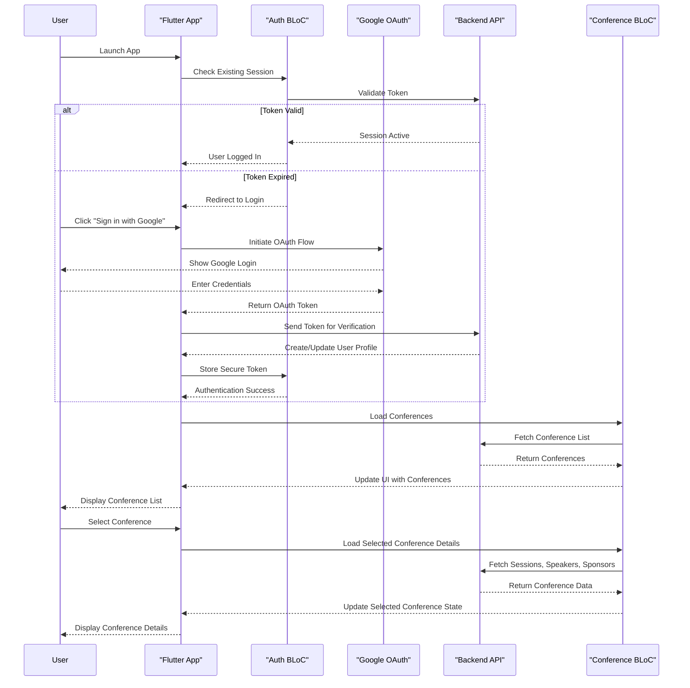
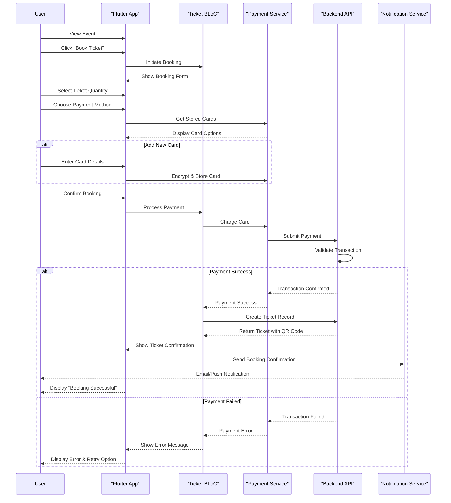
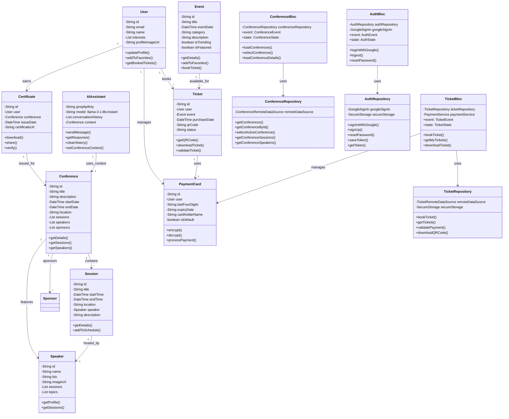
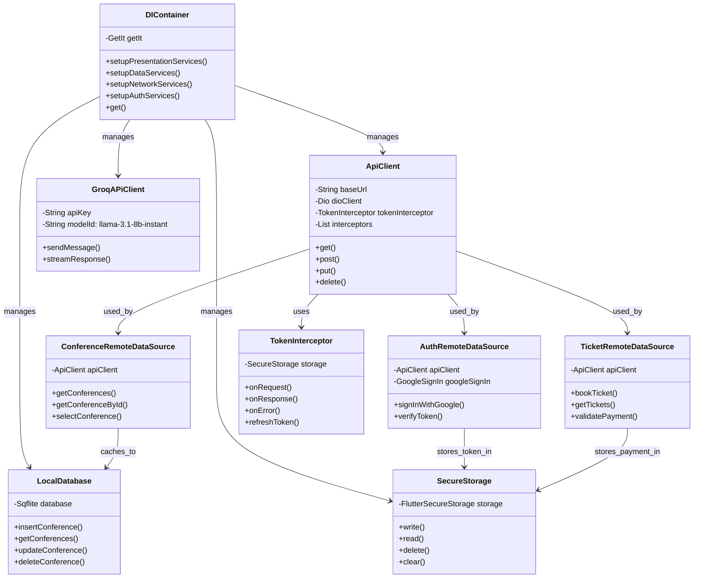

# test_login - Event Management & Conference App

A comprehensive Flutter application for discovering, creating, and managing events and conferences with multi-platform support.

## 📊 System Diagrams

### Use Case Diagram

```mermaid
graph TB
    User["👤 End User"]
    Admin["👨‍💼 Administrator"]
    System["🎯 Conference App"]
    
    User -->|Register & Login| Auth["Authentication"]
    Auth -->|Google OAuth| GoogleAuth["Google Sign-In"]
    GoogleAuth -->|Create Profile| CreateProfile["Create User Profile"]
    
    User -->|Browse| ViewConferences["View Conferences"]
    ViewConferences -->|Select| SelectConference["Select Conference"]
    SelectConference -->|Access| ExploreConf["Explore Conference Details"]
    
    ExploreConf -->|View| ViewSessions["View Sessions"]
    ExploreConf -->|View| ViewSpeakers["View Speakers"]
    ExploreConf -->|View| ViewSponsors["View Sponsors"]
    
    User -->|Discover| DiscoverEvents["Discover Events"]
    DiscoverEvents -->|Filter| FilterEvents["Filter by Category/Interest"]
    DiscoverEvents -->|View Trending| ViewTrending["View Trending Events"]
    
    User -->|Book| BookTicket["Book Ticket"]
    BookTicket -->|Add Card| ManageCards["Manage Payment Cards"]
    BookTicket -->|Pay| ProcessPayment["Process Payment"]
    
    User -->|Manage| ManageTickets["View My Tickets"]
    ManageTickets -->|Download| DownloadTicket["Download QR Ticket"]
    
    User -->|Get Help| UseAI["Use AI Assistant"]
    UseAI -->|Ask Questions| ChatAI["Chat with AI"]
    
    User -->|Save| Favorites["Add to Favorites"]
    Favorites -->|Receive| Notifications["Receive Notifications"]
    
    User -->|Earn| ViewCerts["View Certificates"]
    
    Admin -->|Configure| AdminConf["Configure Conference"]
    Admin -->|Manage| ManageSessions["Manage Sessions"]
    Admin -->|Create| CreateSpeaker["Create Speaker Profile"]
    Admin -->|Verify| VerifyTickets["Verify Tickets"]
    
    style User fill:#e1f5ff
    style Admin fill:#fff3e0
    style Auth fill:#f3e5f5
    style GoogleAuth fill:#fce4ec
    style CreateProfile fill:#fce4ec
    style ViewConferences fill:#f3e5f5
    style SelectConference fill:#fce4ec
    style ExploreConf fill:#fce4ec
    style BookTicket fill:#f3e5f5
    style ManageTickets fill:#f3e5f5
    style UseAI fill:#ffe0b2
    style ChatAI fill:#ffcc80
    style ViewCerts fill:#c8e6c9
```



### Sequence Diagram - User Authentication & Conference Discovery



### Sequence Diagram - Ticket Booking & Payment



### Class Diagram - Architecture Overview



### Class Diagram - Data Layer & DI



## 📋 Features

### Authentication & User Management
- **Google Sign-In** integration for seamless authentication
- User profile creation and editing
- Secure password reset and verification flows
- Interest-based user preferences

### Event Management
- Browse and discover events
- Create and manage personal events
- Featured and trending events display
- Event categories and filtering
- Ticket management (upcoming and past tickets)

### Conference Features
- Conference directory with multiple conferences
- Demo conference for exploration
- Conference-specific configurations
- Schedule, speakers, sponsors, and attendees sections
- Certificate management
- Interactive conference sections

### Ticket & Payment System
- Digital ticket display and download
- Multiple payment card management
- Ticket booking and reservations
- QR code ticket verification

### User Interface
- Responsive design with `flutter_screenutil`
- Custom widgets and UI components
- Material Design principles
- SVG asset support
- Bottom navigation with multiple tabs
- Home, Tickets, and Profile sections

### Advanced Features
- **AI Assistant integration** (Groq API with llama-3.1-8b-instant)
- Card management with encryption
- Secure storage for sensitive data
- Notification system
- Help, privacy, and settings screens

## 🏗️ Project Architecture

The project follows **Clean Architecture** with clear separation of concerns:

```
lib/
├── app/                          # App-specific features
│   ├── controller/               # GetX controllers
│   ├── data/                     # Data providers & API config
│   ├── dialog/                   # Custom dialogs
│   ├── modal/                    # Data models
│   └── view/                     # UI screens
├── base/                         # Base utilities
│   ├── color_data.dart          # Color constants
│   ├── constant.dart            # App constants
│   └── pref_data.dart           # Local preferences
├── core/                         # Core functionality
│   ├── di/                       # Dependency injection (GetIt)
│   ├── network/                  # HTTP client configuration
│   └── routing/                  # GoRouter navigation setup
└── features/                     # Feature modules (BLoC pattern)
    ├── ai_assistant/            # AI chat assistant
    │   ├── data/
    │   ├── domain/
    │   └── presentation/
    ├── auth/                     # Authentication feature
    ├── certificate/             # Certificate management
    ├── conferences/             # Conference data & management
    ├── sessions/                # Conference sessions
    ├── speakers/                # Speaker directory
    └── sponsors/                # Sponsor information
```

## 🛠️ Key Technologies

### State Management & Architecture
- **flutter_bloc**: Reactive state management
- **injectable**: Automatic dependency injection
- **dartz**: Functional programming (Either pattern)

### Navigation & UI
- **go_router**: Type-safe routing
- **flutter_screenutil**: Responsive design
- **freezed_annotation**: Code generation for models

### Data & API
- **dio**: HTTP client with interceptors
- **json_serializable**: JSON serialization
- **flutter_secure_storage**: Encrypted storage

### Authentication & Integration
- **google_sign_in**: OAuth 2.0 authentication
- **flutter_dotenv**: Environment variables

## 🚀 Getting Started

### Prerequisites
- Flutter SDK 3.10.1+ 
- Dart 3.10.1+
- Groq API key (free tier available)

### Installation

1. **Clone repository**
```bash
git clone <repository-url>
cd test_login
```

2. **Create `.env` file** in project root:
```env
# API Configuration
BASE_URL=https://your-api.com/api
CONFERENCES_URL=https://your-api.com/api/conferences

# OAuth
GOOGLE_CLIENT_ID="your-google-client-id.apps.googleusercontent.com"
GOOGLE_SERVER_CLIENT_ID="your-server-client-id.apps.googleusercontent.com"

# Groq AI Assistant
GROQ_API_KEY="your-groq-api-key"
```

3. **Install dependencies**
```bash
flutter pub get
```

4. **Generate code**
```bash
flutter pub run build_runner build
```

5. **Run the app**
```bash
flutter run
```

## 📱 Supported Platforms
- ✅ Android (API 21+)
- ✅ iOS (11.0+)
- ✅ Web
- ✅ Windows
- ✅ Linux
- ✅ macOS

## 🔌 API Integration

### Conference API
- List all conferences
- Get conference details
- Select active conference
- Conference-specific data (sessions, speakers, sponsors)

### Groq AI API
- Chat completion with context
- Model: `llama-3.1-8b-instant`
- Conference context injection
- Error handling with user-friendly messages

### Authentication
- Google OAuth 2.0
- Token management
- Secure credential storage

## 🧪 Testing

### Unit Tests
```bash
flutter test test/
```

### AI Assistant Tests
```bash
flutter test test/features/ai_assistant/
```

Test coverage includes:
- Data source API calls
- Repository implementations
- Integration scenarios
- Error handling
- Message context preservation

## 📦 Build & Deployment

### Development Build
```bash
flutter run -v
```

### Android Release
```bash
flutter build apk --release
flutter build appbundle --release
```

### iOS Release
```bash
flutter build ios --release
```

### Web Release
```bash
flutter build web --release
```

### Desktop Builds
```bash
flutter build linux --release
flutter build windows --release
flutter build macos --release
```

## 🔐 Security Best Practices

1. **API Keys**: Never commit `.env` file with real keys
2. **Secure Storage**: Sensitive data encrypted with `flutter_secure_storage`
3. **HTTPS Only**: All API communication over encrypted channels
4. **Token Management**: Automatic token refresh and validation
5. **OAuth 2.0**: Industry-standard authentication

## 🤖 AI Assistant Features

The integrated AI assistant provides:
- Conference navigation help
- Session recommendations
- Real-time chat responses
- Conference context awareness
- Multi-turn conversation support

### Configuration
- API: Groq (https://api.groq.com)
- Model: `llama-3.1-8b-instant`
- Temperature: 0.7
- Max tokens: 1024

## 🐛 Troubleshooting

### API Key Issues
- Verify `.env` file exists in project root
- Check quotes are removed from values
- Restart app after updating keys: `flutter clean && flutter pub get && flutter run`

### Build Issues
```bash
flutter clean
flutter pub get
flutter pub run build_runner build --delete-conflicting-outputs
```

### AI Assistant Not Responding
- Check console logs for `❌ AI Assistant Error`
- Verify Groq API key is valid
- Check internet connection
- Ensure conference data is loaded

## 📄 Project Structure Details

### App Module (`lib/app/`)
Main application screens and controllers:
- Home screen with event listings
- Ticket management interface
- User profile and settings
- Payment card management

### Features (Clean Architecture BLoC Pattern)
Each feature has:
- **Domain**: Business logic, repositories, entities
- **Data**: API clients, repository implementations
- **Presentation**: UI, BLoC for state management

### Base Module
Common utilities and constants shared across app.

### Core Module
Framework setup: DI, routing, network configuration.

## 🔄 Development Workflow

1. Create feature branch
2. Implement in feature module
3. Write tests for business logic
4. Run `flutter test`
5. Format code: `flutter format`
6. Run analyzer: `flutter analyze`
7. Submit PR

## 📋 Environment Setup

### Required Environment Variables
```
BASE_URL              # Your API endpoint
GOOGLE_CLIENT_ID      # From Google Cloud Console
GOOGLE_SERVER_CLIENT_ID # From Google Cloud Console
GROQ_API_KEY         # From Groq Console (groq.com)
```

### Asset Configuration
- Flutter assets in `assets/` directory
- Images: `assets/images/`
- Demo data: `assets/data/demo_conference.json`

## 🎨 UI Customization

### Colors
Configure in `lib/base/color_data.dart`:
```dart
class ColorData {
  static const primary = Color(0xFF);
  // ... more colors
}
```

### Fonts
- Family: Gilroy (available: Bold, Regular, SemiBold, Medium)
- Configure in `pubspec.yaml`

## 📞 Support & Documentation

- **Flutter Docs**: https://flutter.dev/docs
- **Groq API**: https://console.groq.com/docs
- **GoRouter**: https://github.com/csells/go_router
- **BLoC Pattern**: https://bloclibrary.dev

## 📈 Performance Tips

1. Use `const` constructors
2. Lazy load heavy widgets with `ListView.builder`
3. Cache API responses locally
4. Limit message history in AI chat
5. Use appropriate BLoC scope

## 🤝 Contributing

Contributions welcome! Please:
1. Follow clean code principles
2. Add tests for new features
3. Update documentation
4. Follow project architecture patterns

## 📄 License

This project is licensed under the MIT License - see LICENSE file for details.

---

**Version**: 0.1.0  
**Last Updated**: May 2026  
**Flutter**: 3.10.1+  
**Dart**: 3.10.1+
